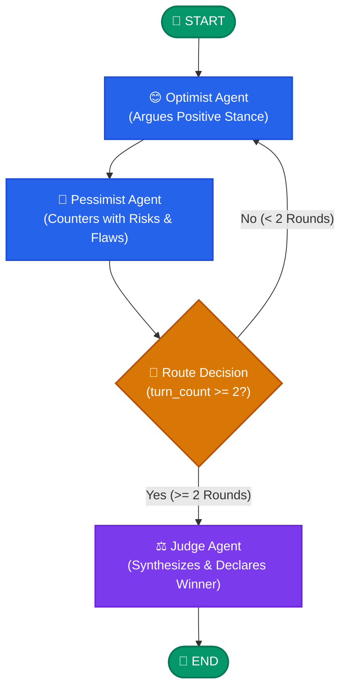

# 🤖 Autonomous Multi-Agent Debate System

<p align="center">
  
  
  
  
</p>

An autonomous multi-agent debate framework built with **LangGraph**, **LangChain**, and **OpenAI GPT-4o-mini**. The system simulates a structured intellectual debate between opposing AI personas (**Optimist** vs. **Pessimist**) coordinated through a stateful graph workflow, culminating in an objective verdict from an **AI Judge**.

---

## 👨‍💻 Author
- **Yash Kirti Singh**

---
## 📑 Table of Contents

- [Overview](#-overview)
- [Key Features](#-key-features)
- [Architecture & Graph Workflow](#-architecture--graph-workflow)
  - [Workflow Diagram](#workflow-diagram)
  - [State Management (`DebateState`)](#state-management-debatestate)
  - [Agent Personas & Logic](#agent-personas--logic)
- [Project Structure](#-project-structure)
- [Environment Setup & Installation](#-environment-setup--installation)
  - [Prerequisites](#prerequisites)
  - [Step-by-Step Setup](#step-by-step-setup)
- [Usage](#-usage)
  - [Running the Debate](#running-the-debate)
  - [Customizing the Topic](#customizing-the-topic)
  - [Configuring Debate Parameters](#configuring-debate-parameters)
- [Example Debate Output](#-example-debate-output)
- [Extending the System](#-extending-the-system)
- [Contributing](#-contributing)
- [License](#-license)

---

## 🌟 Overview

Multi-agent debate systems improve reasoning, minimize model hallucinations, and provide multi-faceted perspectives on complex dilemmas. This repository implements a cyclical graph workflow that:
1. Passes an initial topic to an **Optimist Agent**.
2. Routes the optimistic premise to a **Pessimist Agent** for counterarguments.
3. Automatically increments round counters and repeats the exchange until a defined threshold is reached.
4. Transitions state to an impartial **Judge Agent** to synthesize arguments and declare a logical winner.

---

## ✨ Key Features

- **🔄 Stateful Graph Orchestration**: Built on LangGraph `StateGraph` leveraging cyclic edges and conditional routing logic.
- **🎭 Distinct Persona Prompting**: System prompt engineering enforcing strict rhetorical stances (constructive vision vs. critical risk analysis).
- **⚡ Append-Reducer History**: Automatic conversation synchronization across nodes using LangGraph's `add_messages` reducer.
- **⚖️ Impartial Synthesis**: Automated verdict generation assessing rhetorical coherence, logical consistency, and empirical strength.
- **📡 Real-Time Token/Node Streaming**: Event-driven execution streaming agent contributions directly to the terminal as they execute.

---

## 🏗️ Architecture & Graph Workflow

### Workflow Diagram



### State Management (`DebateState`)

The state schema is defined with `TypedDict` and manages the shared execution context across graph transitions:

| Field | Type | Description |
| :--- | :--- | :--- |
| `topic` | `str` | The debate topic or prompt being evaluated. |
| `messages` | `Annotated[list, add_messages]` | Chronological history of LLM messages automatically appended via reducer. |
| `turn_count` | `int` | Counter tracking completed debate rounds (incremented on each pessimist response). |

### Agent Personas & Logic

1. **Optimist Agent (`optimist_agent`)**:
   - **Role**: Champions the prospective benefits, technological breakthroughs, and positive outcomes of the topic.
   - **Constraint**: Short, single-paragraph targeted responses addressing prior points.
2. **Pessimist Agent (`pessimist_agent`)**:
   - **Role**: Identifies critical vulnerabilities, ethical dilemmas, resource constraints, and negative externalities.
   - **State Update**: Updates `messages` and increments `turn_count` by `+1`.
3. **Routing Function (`route_debate`)**:
   - Evaluates whether `turn_count >= 2`. If true, directs execution to `judge`; otherwise loops back to `optimist`.
4. **Judge Agent (`judge_agent`)**:
   - **Role**: Impartially analyzes arguments from both personas, balances trade-offs, and issues a final, reasoned verdict.

---

## 📁 Project Structure

```
Multi-Agent-Debate-System/
│
├── debate_app.py        # Core LangGraph graph definition, agent nodes & execution entrypoint
├── requirements.txt     # Production dependencies (LangGraph, LangChain, OpenAI, Dotenv)
├── .env.example         # Template for environment configuration
├── .gitignore           # Git ignore rules for virtual environments and credentials
└── README.md            # Comprehensive project documentation
```

---

## ⚙️ Environment Setup & Installation

### Prerequisites

- **Python**: Version `3.10` or higher
- **OpenAI API Key**: Access to OpenAI models (defaults to `gpt-4o-mini`)
- **Git**: For version control

### Step-by-Step Setup

1. **Clone the Repository**
   ```bash
   git clone https://github.com/yashkirtisingh1789/Multi-Agent-Debate-System.git
   cd Multi-Agent-Debate-System
   ```

2. **Create and Activate a Virtual Environment**
   - **On macOS / Linux:**
     ```bash
     python3 -m venv .venv
     source .venv/bin/activate
     ```
   - **On Windows (Command Prompt):**
     ```cmd
     python -m venv .venv
     .venv\Scripts\activate.bat
     ```
   - **On Windows (PowerShell):**
     ```powershell
     python -m venv .venv
     .venv\Scripts\Activate.ps1
     ```

3. **Install Dependencies**
   ```bash
   pip install --upgrade pip
   pip install -r requirements.txt
   ```

4. **Configure Environment Variables**
   - Duplicate `.env.example` to create your local `.env`:
     ```bash
     cp .env.example .env
     ```
   - Open `.env` and configure your API key:
     ```env
     OPENAI_API_KEY="sk-proj-yourOpenAiApiKeyHere..."
     ```

---

## 🚀 Usage

### Running the Debate

Execute the main application script:

```bash
python debate_app.py
```

### Customizing the Topic

To change the debate topic, edit the `topic` variable in [debate_app.py](file:///Users/yashkirtisingh/Desktop/multi_agent_debate/debate_app.py):

```python
if __name__ == "__main__":
    topic = "Should artificial general intelligence development be paused globally?"
    # ...
```

### Configuring Debate Parameters

- **Change Number of Rounds**: Modify the condition in `route_debate()`:
  ```python
  def route_debate(state: DebateState):
      # Set to desired number of rounds (e.g., 3 or 4)
      if state["turn_count"] >= 3:
          return "judge"
      return "optimist"
  ```
- **Change LLM Model or Temperature**:
  ```python
  llm = ChatOpenAI(model="gpt-4o", temperature=0.5)
  ```

---

## 💬 Example Debate Output

```text
=== STARTING DEBATE ===
Topic: Should humans prioritize exploring space or fixing the Earth first?

--- OPTIMIST ---
Prioritizing space exploration drives technological breakthroughs, clean energy innovations, and resource discovery that directly solve Earth's most pressing challenges. By expanding beyond our borders, we inspire global cooperation and ensure the long-term survival of human civilization.

--- PESSIMIST ---
Investing trillions into interplanetary dreams while Earth faces imminent climate crises, poverty, and ecological collapse is reckless escapism. Breakthroughs are uncertain and distant, while the problems facing our planet are immediate, catastrophic, and require our undivided focus and capital.

--- OPTIMIST ---
History proves that exploration is not escapism—it is the catalyst for rapid innovation. Satellite monitoring, solar power advancements, and water purification technologies were all born from space missions and are actively healing Earth today. We can address immediate issues while expanding human capability.

--- PESSIMIST ---
Those derived technologies are incremental compared to the massive opportunity cost of diverting finite global resources away from direct climate mitigation and conservation. We cannot afford the luxury of speculative innovation when our primary life-support system is actively degrading.

--- JUDGE ---
Both sides presented compelling arguments. The Optimist established that space initiatives generate vital cross-disciplinary technologies. However, the Pessimist successfully argued that the immediacy and severity of Earth's ecological crises create an urgent priority that outweighs the speculative returns of space colonization. 

Verdict: PESSIMIST wins this debate on the basis of existential urgency and resource prioritization.
```

---

## 🧩 Extending the System

Here are recommended avenues to expand the framework:

- [ ] **Third-Party Tools**: Equip agents with search tools (e.g., Tavily API) for evidence-backed debates with real citations.
- [ ] **Multi-Persona Panels**: Introduce an *Ethicist*, *Economist*, or *Technologist* to form a round-table debate panel.
- [ ] **Human-in-the-Loop**: Integrate LangGraph's `MemorySaver` checkpointer and interrupt mechanisms to allow human audience voting or mid-debate questions.
- [ ] **Web Interface**: Wrap the LangGraph stream in a **Streamlit**, **Gradio**, or **Next.js + FastAPI** frontend.

---

## 🤝 Contributing

Contributions are welcome! If you'd like to improve the debate workflow:

1. Fork the repository.
2. Create a feature branch (`git checkout -b feature/dynamic-personas`).
3. Commit your changes (`git commit -m "feat: add dynamic persona support"`).
4. Push to the branch (`git push origin feature/dynamic-personas`).
5. Open a Pull Request.

---

## 📄 License

This project is licensed under the MIT License — see the [LICENSE](LICENSE) file for details.
